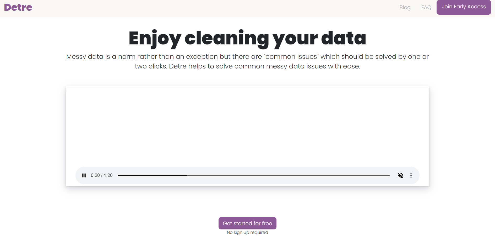
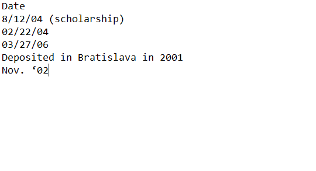

<!-- TABLE OF CONTENTS -->

  
Table of Contents

  <ol>
    <li>
      <a href="#about-the-project">About The Project</a>
      <ul>
        <li><a href="#built-with">Built With</a></li>
      </ul>
    </li>
    <li>
      <a href="#getting-started">Getting Started</a>
    </li>
    <li><a href="#usage">Usage</a></li>
    <li><a href="#roadmap">Roadmap</a></li>
    <li><a href="#license">License</a></li>
    <li><a href="#contact">Contact</a></li>
  </ol>

## About The Project

Data scientists mention that one of the least enjoyable parts of their work is data cleaning.  Several surveys have recorded this sentiment over time, and it has not changed. Not only do they not enjoy data cleaning, but it also
happens to form part of the bulk of the work they need to do. Nonetheless, they do have powerful and valuable tools at
their disposal to get the job done.

Now imagine how someone who is not a data scientist working with data feels about data cleaning? Take, for example, this <a href="https://www.mrexcel.com/board/threads/how-to-clean-up-and-format-very-messy-date-and-non-date-date.1017938/">post</a> where a user has to clean the dates of their data set. The image below shows the messy dates and the desired clean dates. Making the necessary transformations to get clean dates is a non-trivial task if the dataset has 100s or 1000s of rows. They will need to have above average skills in Excel or may use a programming language such as Python or R. Learning
to program or develop above-average skills in Excel do take time; meanwhile, the deadline is looming.

The available tools in Excel do not easily cater for what we call <code>common edge cases</code>. The term may sound contradictory because, by its nature, an edge case is uncommon. However, the situation the user above faces is often met by several people who need to make such non-trivial data cleaning transformations. Having a tool that will make it easy and intuitive to clean your data will be indispensable to people's toolkits. Hence the birth of Detre.

Detre will allow salespeople, marketing managers, etc. (i.e. ), to clean their small to medium-sized data with relative ease.  The user will not be
expected to have any coding skills or Excel/Google sheets knowledge.  They will only need to upload their data and guide us to their desired output.

Our vision is to half the time spent on cleaning data. We know it won't be easy, but it's worth striving for.  Are you joining us on this mission? Then send us your <code>common edge case</code> and let's get started.

### Built With

* [Flask](https://flask.palletsprojects.com/en/2.2.x/)

* [Bootstrap](https://getbootstrap.com/docs/4.0/getting-started/introduction/)

* [MySQL](https://www.mysql.com/)

## Getting Started

 - Make sure MySQL is installed

 - Create .env file. See the .env.sample file for required variables
 
 - Setup a virtual environment

 - Install the requirements.txt

 - Start the application with <code> python app.py </code>

## Usage

Please see our YouTube channel for examples: https://www.youtube.com/channel/UCB4xcEMbw-0-pLzKfvDHFbw

## Roadmap

- [x] Add Tests
- [ ] Refactor inline css 
- [ ] Add user documentation
- [ ] Add more FAQs

## License

MIT License

## Contact

Email  - ntuthuko@zetra.io

